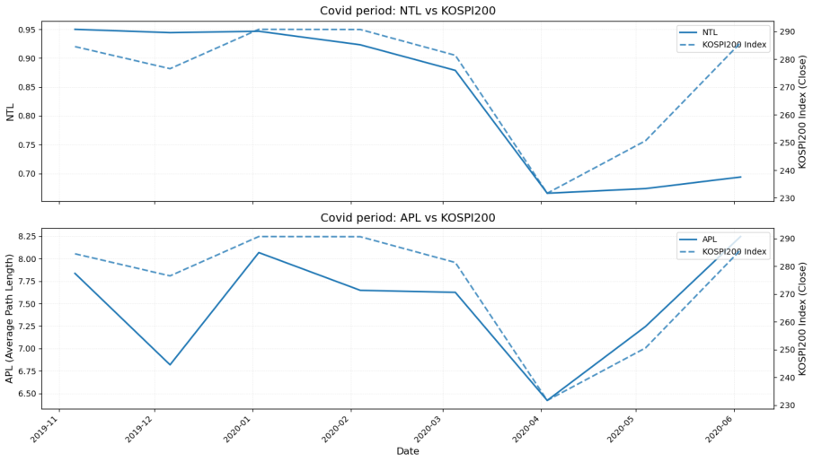
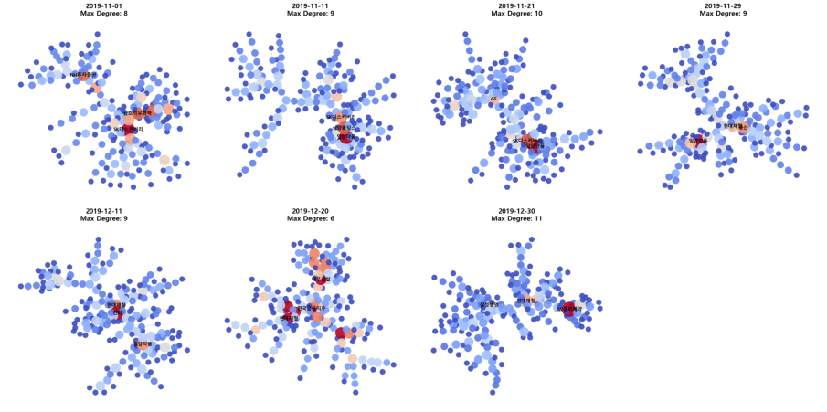
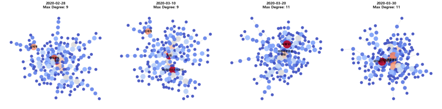
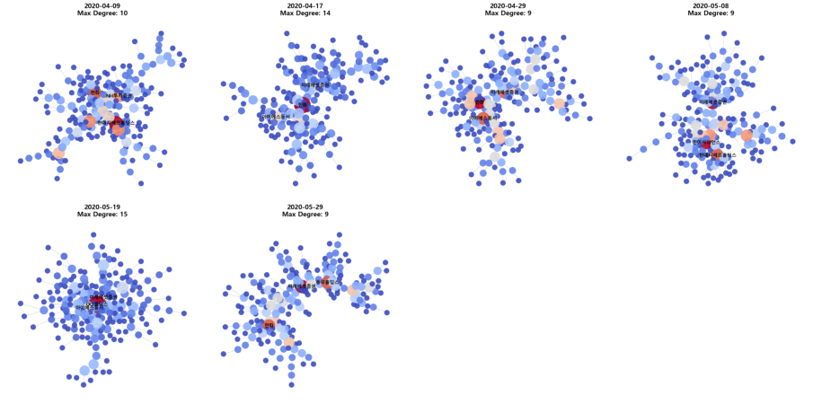

# KOSPI200 네트워크 분석

### 코로나19 전후, 가격의 변화와 함께 종목 간 연결 구조는 어떻게 달라졌을까?

KOSPI200 종목의 수익률 상관관계를 **동적 최소 신장 트리(Dynamic MST)**로 표현하고, 코로나19 위기 전후의 시장 동조화와 중심 종목의 변화를 분석한 소셜네트워크 과학 팀 프로젝트입니다.

**핵심 관찰:** 코로나 충격을 포함한 윈도우에서 트리의 평균 거리가 짧아지고 평균 경로 길이가 감소했습니다. 국면별 중심성 분석에서는 네트워크 중심부를 구성하는 종목과 섹터도 달라졌습니다.

[전체 분석 보고서 읽기](reports/kospi200-network-analysis.pdf)

`Financial Networks` · `Correlation` · `Dynamic MST` · `NetworkX` · `Centrality`

## 1. 분석 질문

- 코로나19 급락·반등 과정에서 KOSPI200 종목 간 상관관계 네트워크는 어떻게 변했는가?
- 네트워크의 거리와 연결 경로는 시장의 동조화를 어떻게 보여주는가?
- 국면별로 어떤 종목이 허브와 브릿지 위치에 있었는가?

지수의 등락을 넘어 **종목 간 관계 구조의 변화**를 살펴보는 데 초점을 맞췄습니다.

## 2. 데이터와 분석 설계

| 항목 | 보고서의 분석 설계 |
| --- | --- |
| 대상 | 각 윈도우 종료일 기준 KOSPI200 구성 종목 |
| 입력 | 일별 수정주가로 계산한 로그 수익률 |
| 전체 분석 기간 | 데이터 설명 기준 2018-01-01 ~ 2025-06-30 |
| 코로나 집중 분석 | 2019-11-01 ~ 2020-05-29 |
| 거시 분석 | 180일 윈도우, 30일 스텝 |
| 미시 분석 | 90일 윈도우, 10일 스텝 |
| 네트워크 구성 | 수익률 상관계수를 거리로 변환한 뒤 NetworkX로 MST 추출 |

### 분석 과정

1. 가격을 로그 수익률로 변환합니다.
2. 각 윈도우에서 종목 간 상관계수 $\rho_{ij}$를 계산합니다.
3. 상관계수를 거리 $d_{ij}=\sqrt{2(1-\rho_{ij})}$로 변환합니다.
4. 모든 종목을 연결하면서 거리 합이 최소인 MST를 추출합니다.
5. 트리의 거리·경로 지표와 중심성을 계산하고 시간에 따른 변화를 비교합니다.

상관계수가 높을수록 거리가 짧아집니다. MST는 $N$개 노드를 $N-1$개 엣지로 연결해 복잡한 상관관계의 골격을 보여줍니다.

### 사용한 지표

| 지표 | 의미 | 분석 목적 |
| --- | --- | --- |
| NTL (Normalized Tree Length) | MST 엣지 거리의 평균 | 선택된 연결의 동조화 정도 비교 |
| APL (Average Path Length) | 트리에서 두 노드 사이 최단 경로 길이의 평균 | 연결 경로가 짧아지는 구조 변화 비교 |
| 고유벡터 중심성 | 중요한 노드와 연결된 정도 | 허브 종목 탐색 |
| 매개 중심성 | 최단 경로가 해당 노드를 경유하는 정도 | 브릿지 종목 탐색 |

보고서는 평균 경로 지표를 ATL과 APL로 혼용합니다. 이 소개에서는 그림의 표기를 따라 APL로 통일했습니다. 경로 길이의 가중 여부와 중심성 계산의 세부 설정은 원본 코드 확인이 필요합니다.

## 3. 주요 결과

### 위기 구간: 거리와 경로 길이의 동반 감소

보고서의 코로나 확대 그림에서 NTL은 위기 이전 약 0.94~0.95에서 충격을 포함한 윈도우의 약 0.67까지 하락합니다. APL도 약 7~8 수준에서 약 6.4 수준으로 낮아집니다.

이는 **MST에 남은 종목 간 연결의 상관관계가 강해지고, 평균 연결 경로가 짧아졌음**을 보여줍니다. 지수 반등 이후에는 APL이 다시 늘어나지만, 그림의 마지막 시점까지 NTL의 회복은 제한적입니다. 가격 반등과 관계 구조의 회복이 같은 속도로 진행되지는 않는다는 점도 관찰할 수 있습니다.

이 결과는 위기 당시 동조화와 구조적 집중을 해석하는 근거입니다. 위기 예측력이나 실제 분산투자 성과를 검증한 결과는 아닙니다.

### 국면별 중심 종목의 변화

다음은 보고서에 제시된 중심성 상위 종목의 집합입니다. 원문의 순위와 수치에는 정렬상 불일치가 있어, 여기서는 순위 없이 제시합니다.

| 국면 | 고유벡터 중심성 상위 종목 | 매개 중심성 상위 종목 |
| --- | --- | --- |
| 안정기 | 삼양홀딩스, SK디스커버리, 일양약품, JW홀딩스, 동아에스티 | 현대제철, NH투자증권, SK디스커버리, 기업은행, 동국홀딩스 |
| 위기 전 | 한화, 현대제철, OCI홀딩스, 오리온홀딩스, BGF | OCI홀딩스, 현대제철, 현대건설, HD현대인프라코어, 기업은행 |
| 위기 | 한화, 미래에셋증권, 현대건설, 현대제철, GS건설 | 한화, GS건설, 현대건설, 남해화학, NH투자증권 |
| 회복기 | OCI홀딩스, 미래에셋증권, HD현대미포, LX인터네셔널, LG디스플레이 | OCI홀딩스, HD현대미포, 현대건설, 미래에셋증권, 한화솔루션 |

위기에는 건설·철강·금융 등 경기민감 업종의 종목이 중심부에 나타났고, 회복기에는 조선·상사·디스플레이 등으로 중심 종목의 구성이 달라졌습니다. 여기서 중심성은 **상관관계 네트워크의 위치**를 뜻하며, 해당 종목이 가격 변화를 유발했다는 인과관계를 의미하지 않습니다.

### 네트워크 스냅샷

**안정기**

**위기**

**회복기**

그림은 보고서에서 추출한 원본 시각화입니다. 배치상 밀집도는 그래프 레이아웃의 영향을 받으므로, 구조 변화는 NTL·APL과 중심성 지표를 함께 보며 해석해야 합니다.

## 4. 해석의 범위와 한계

- **상관관계와 인과관계:** MST는 함께 움직이는 관계를 요약합니다. 충격의 실제 전파 방향이나 원인을 직접 식별하지 않습니다.
- **필터링의 영향:** MST는 항상 $N-1$개 엣지만 남깁니다. 대체 연결은 제거되며, MST의 경로가 실제 시장의 유일한 경로라는 뜻은 아닙니다.
- **윈도우의 영향:** 장기간의 관측값을 묶기 때문에 충격이 지표에 반영되는 시점과 실제 사건 시점에는 차이가 생길 수 있습니다. 선행 경보 성능은 별도 검증이 필요합니다.
- **재현 가능성:** 이 저장소에는 보고서와 추출 이미지가 포함되어 있습니다. 원본 분석 코드와 데이터가 포함되지 않아 수치의 독립 재현은 제공하지 않습니다.
- **원문 정합성:** 보고서에는 분석 시작 연도, 국면 경계, ATL/APL 표기, 일부 중심성 표의 순위·섹터 설명에 불일치가 있습니다. PDF 원문은 그대로 보존했으며, README는 데이터 설명과 그림에서 확인할 수 있는 내용을 중심으로 작성했습니다.

## 5. 확장 가능한 분석

- 윈도우 길이와 구성 종목 변경에 따른 결과의 민감도 확인
- 시장 공통요인을 제거한 잔차 수익률 네트워크와 비교
- MST와 전체 상관행렬 또는 다른 필터링 방법의 결과 비교
- 네트워크 지표와 변동성·분산투자 효과의 관계를 별도 검증

## 6. 저장소 구성

| 경로 | 내용 |
| --- | --- |
| `README.md` | 프로젝트 질문, 방법, 결과와 한계 |
| `reports/kospi200-network-analysis.pdf` | 팀 프로젝트 원본 보고서 |
| `assets/` | 보고서에서 추출한 주요 그래프 |

본 저장소는 소셜네트워크 과학 수업의 팀 프로젝트를 정리한 보고서 중심 포트폴리오입니다.
